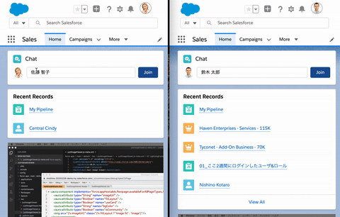
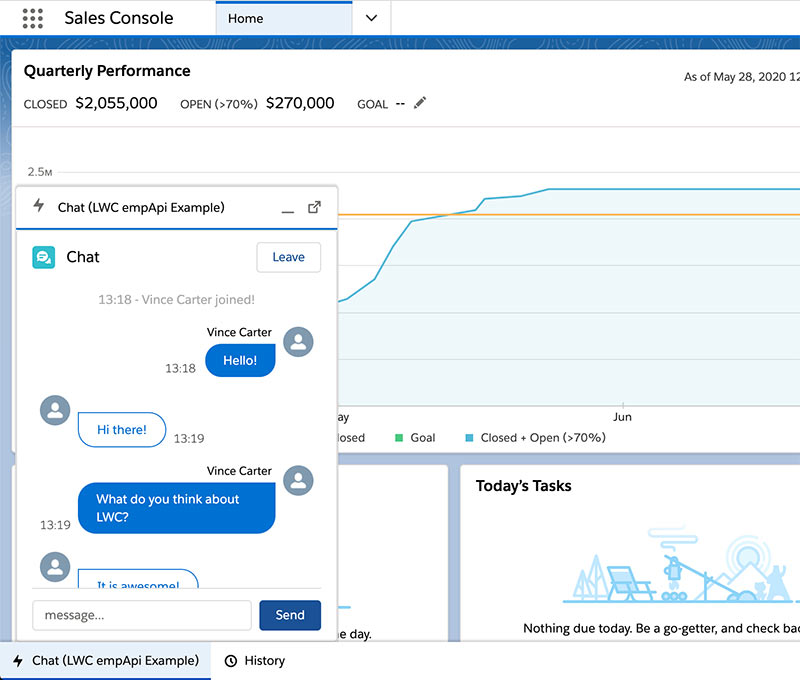

# LWC Chat App powered by Platform Event

Simple chat component developed with LWC and platform event pub/sub(empApi + Apex).
After installation, make sure that user profiles have Read & Create access to LWC_Chat__e PlatformEvent sObject.

Salesforce上で簡易的にユーザー間チャットを実現するLWCコンポーネントです。
プラットフォームイベントをPub/Subしています。
利用される際は、利用するユーザーのプロファイル設定で、LWC_Chat__eオブジェクトのRead/Create権限を付与してから利用してください。

# 免責 (Disclaimer)
本コードは Lightning Platform および LWCの技術検証をかねて個人として作成したものであり、動作の正確性、セキュリティ上の安全性などについて保証するものではありません。Lightning Platform および LWCの実装のサンプルコードとして個人として公開するものです。
